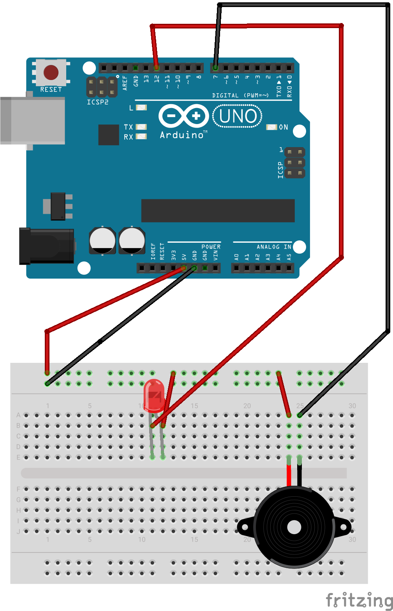
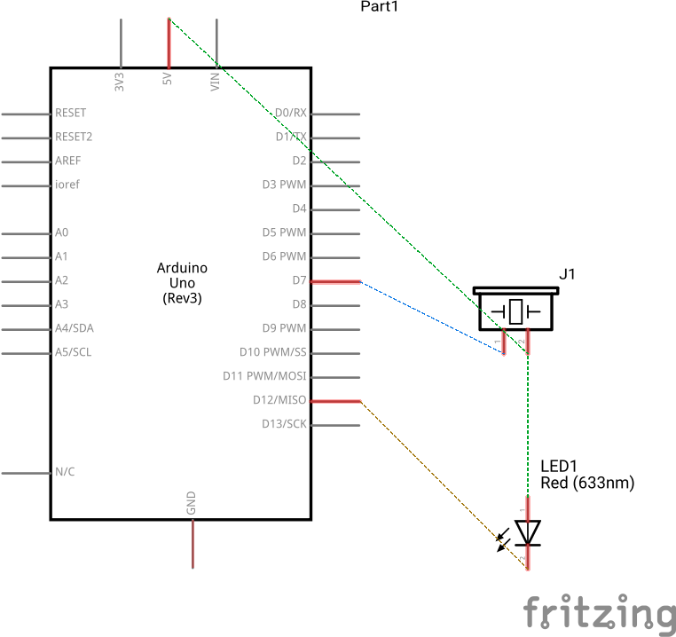

# FACE RECOGNITION ATTENDANCE SYSTEM

## Requirements

-   [Python 3.6](https://www.python.org/ftp/python/3.6.15/Python-3.6.15.tgz)
-   [requirements.txt](./requirements.txt)

## Setup

### Virtual Environment

```sh
cd path/to/cloned/folder
python3.6 -m venv venv
source ./venv/bin/activate
```

### Arduino setup

-   Connect the Arduino to the computer
-   Upload the [Arduino code](./firmata-config-arduino/firmata-config-arduino.ino) to the Arduino

## Installation

```sh
pip install --upgrade pip
pip install -r requirements.txt
```

## Circuit Diagram




## Running

```sh
python -u main.py # after activating the virtual environment
```

## Usage

-   If you want to add a new person, add the images in a new folder in the `all-images` folder
-   The name of the folder should be the name of the person
-   Run the program
-   If person is recognized, the name will be displayed on the screen, and the red `led` would light up
-   If person is not recognized, the name will be displayed as `Unknown`, and the buzzer would buzz
